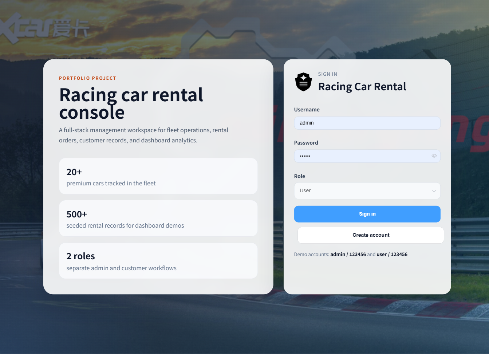
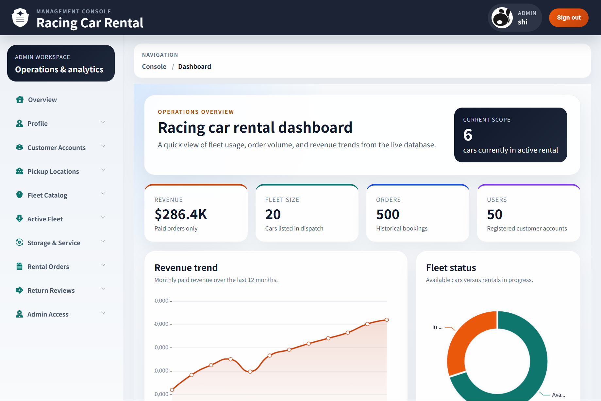
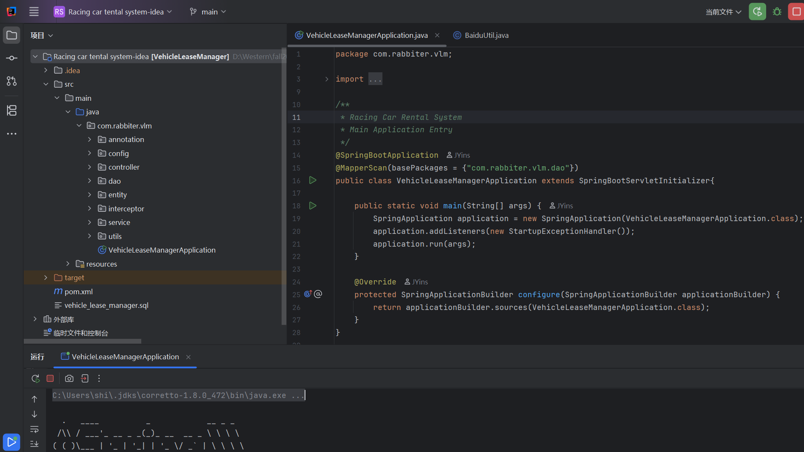
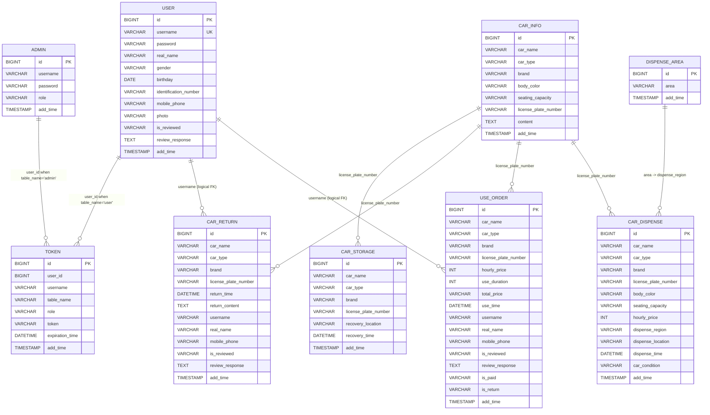

# Racing Car Rental Management System

This project is a full-stack car rental system I built as a personal learning project, with backend practice as the main focus.

I used the rental domain to work through realistic backend problems such as authentication, CRUD workflows, order and return handling, SQL-backed dashboard queries, and database design with MySQL.

## Project overview

The system covers the main workflow of a small rental business:

- browse available cars with specs and images
- place rental orders and track payment status
- process returns and review overdue cases
- manage fleet inventory and dispatch locations
- monitor revenue, orders, and fleet status from the dashboard

## Quick look

### Login



### Dashboard



### Backend



## Stack

- Backend: Java, Spring Boot, MyBatis-Plus
- Frontend: Vue 2, Element UI, ECharts
- Database: MySQL 8
- Data tooling: Python mock data generator

## Why I built it

- Practice building a CRUD-heavy backend around a consistent relational data model.
- Connect Spring Boot, MyBatis-Plus, and MySQL to a working frontend instead of stopping at API-only demos.
- Work through business flows that are more realistic than simple todo-style examples.

## Backend focus

- Built backend modules for users, fleet records, rental orders, return records, authentication, and dashboard statistics.
- Implemented statistics endpoints that read live MySQL data instead of returning hardcoded dashboard numbers.
- Used a layered Spring Boot structure with controller, service, DAO, mapper, and SQL resources.
- Modeled the main business relationships around cars, dispatch records, orders, returns, and user accounts.

## Database design

The project uses a MySQL schema centered around vehicle records, rental orders, return records, storage records, users, and auth tokens.

The current implementation mainly uses application-level logical relationships instead of database-enforced foreign keys. In practice, the core joins and business references are built around `username`, `user_id`, `license_plate_number`, and `dispense_region`.

### Main logical relationships

- `user.username` -> `use_order.username`
- `user.username` -> `car_return.username`
- `car_info.license_plate_number` -> `car_dispense.license_plate_number`
- `car_info.license_plate_number` -> `use_order.license_plate_number`
- `car_info.license_plate_number` -> `car_return.license_plate_number`
- `car_info.license_plate_number` -> `car_storage.license_plate_number`
- `dispense_area.area` -> `car_dispense.dispense_region`
- `token.user_id` -> `user.id` or `admin.id` depending on `token.table_name`

### dbdiagram.io schema

```dbml
Table admin {
  id bigint [pk, increment]
  username varchar(100) [not null]
  password varchar(100) [not null]
  role varchar(100) [default: 'Admin']
  add_time timestamp [not null]
}

Table user {
  id bigint [pk, increment]
  username varchar(200) [not null, unique]
  password varchar(200) [not null]
  real_name varchar(200)
  gender varchar(200)
  birthday date
  identification_number varchar(200)
  mobile_phone varchar(200)
  photo varchar(255)
  is_reviewed varchar(200) [default: 'No']
  review_response text
  add_time timestamp [not null]
}

Table car_info {
  id bigint [pk, increment]
  car_name varchar(200)
  car_type varchar(200)
  brand varchar(200)
  body_color varchar(200)
  seating_capacity varchar(200)
  license_plate_number varchar(200)
  content text
  add_time timestamp [not null]
}

Table car_dispense {
  id bigint [pk, increment]
  car_name varchar(200)
  car_type varchar(200)
  brand varchar(200)
  license_plate_number varchar(200)
  body_color varchar(200)
  seating_capacity varchar(200)
  hourly_price int [not null]
  dispense_region varchar(200)
  dispense_location varchar(200)
  dispense_time datetime
  car_condition varchar(200)
  add_time timestamp [not null]
}

Table use_order {
  id bigint [pk, increment]
  car_name varchar(200)
  car_type varchar(200)
  brand varchar(200)
  license_plate_number varchar(200)
  hourly_price int
  use_duration int [not null]
  total_price varchar(200)
  use_time datetime
  username varchar(200)
  real_name varchar(200)
  mobile_phone varchar(200)
  is_reviewed varchar(200) [default: 'No']
  review_response text
  is_paid varchar(200) [default: 'Unpaid']
  is_return varchar(255) [default: 'No']
  add_time timestamp [not null]
}

Table car_return {
  id bigint [pk, increment]
  car_name varchar(200)
  car_type varchar(200)
  brand varchar(200)
  license_plate_number varchar(200)
  return_time datetime
  return_content text
  username varchar(200)
  real_name varchar(200)
  mobile_phone varchar(200)
  is_reviewed varchar(200) [default: 'No']
  review_response text
  add_time timestamp [not null]
}

Table car_storage {
  id bigint [pk, increment]
  car_name varchar(200)
  car_type varchar(200)
  brand varchar(200)
  license_plate_number varchar(200)
  recovery_location varchar(200)
  recovery_time datetime
  add_time timestamp [not null]
}

Table dispense_area {
  id bigint [pk, increment]
  area varchar(200) [not null]
  add_time timestamp [not null]
}

Table token {
  id bigint [pk, increment]
  user_id bigint [not null]
  username varchar(100) [not null]
  table_name varchar(100)
  role varchar(100)
  token varchar(200) [not null]
  expiration_time datetime [not null]
  add_time timestamp [not null]
}

Ref: use_order.username > user.username
Ref: car_return.username > user.username
Ref: car_dispense.dispense_region > dispense_area.area
Ref: car_dispense.license_plate_number > car_info.license_plate_number
Ref: use_order.license_plate_number > car_info.license_plate_number
Ref: car_return.license_plate_number > car_info.license_plate_number
Ref: car_storage.license_plate_number > car_info.license_plate_number
Ref: token.user_id > user.id
Ref: token.user_id > admin.id
```

### Mermaid ER diagram



## Synthetic data

I used [`db_data_generator.py`](db_data_generator.py) to create synthetic records for local testing and dashboard validation.

The generated data is only for demo and test scenarios. The schema setup, SQL integration, backend logic, and application workflow were implemented manually.

## Local setup

### 1. Create the database

```sql
CREATE DATABASE vehicle_lease_manager;
USE vehicle_lease_manager;
SOURCE vehicle_lease_manager.sql;
SOURCE insert_mock_data.sql;
```

### 2. Start the backend

Open `Racing car tental system-idea` in IntelliJ IDEA and update `src/main/resources/application.yml` with your MySQL credentials.

Then run `VehicleLeaseManagerApplication.java`.

Backend URL:
`http://localhost:9341`

### 3. Start the frontend

```bash
cd "Racing car tental system-VUE"
npm install
npm run dev
```

Frontend URL:
`http://localhost:9342`

## Demo accounts

- Admin: `admin / 123456`
- User: `user / 123456`

## Project layout

- `Racing car tental system-idea/`
- `Racing car tental system-VUE/`
- `vehicle_lease_manager.sql`
- `insert_mock_data.sql`
- `db_data_generator.py`

## Notes

- The payment flow is simulated with status updates rather than a real payment gateway.
- The current setup is intended for local development and learning.
- The strongest backend areas to review are the schema design, order and return flow, statistics endpoints, and synthetic data pipeline.
